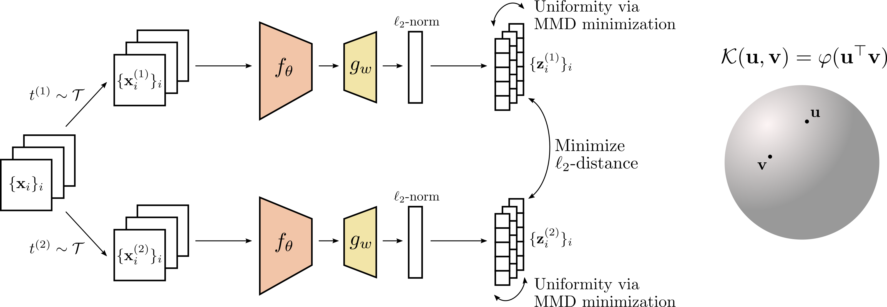

# SFRIK: Self-supervised learning with rotation-invariant kernels

This repository provides a PyTorch implementation and pretrained models for SFRIK, as described in the paper [Self-supervised learning with rotation-invariant kernels]().\
Léon Zheng, Gilles Puy, Elisa Riccietti, Patrick Pérez, Rémi Gribonval.



## Pretrained models

We provide our pretrained ResNet-50 backbone pretrained on full ImageNet during 200 epochs 
with SFRIK (truncation order L=3, embedding dimension q=32768).

| Method | Epochs | Batch-size | Dataset | ImageNet linear acc. | Links to pretrained weights |
|----------------|-------------------|---------------------|--------------------|--------------------|--------------------|
| SFRIK (L=3, q=32768) | 200 | 2048 | ImageNet | 70.3 | [backbone only]() / [full checkpoint]()  |


## Pretraining code

### Specification of dependencies
This current implementation requires:
* Python 3.9.7
* PyTorch 1.10.0
* torchvision
* CUDA 10.2
* Other dependencies: pandas, numpy, PIL

Make sure that you have installed the source code of the repository before running pretraining and evaluation scripts.
```
pip install -e .
```

### Pretraining on full ImageNet-1000 with ResNet50 backbone

#### Single node pretraining
  
  We pretrain a ResNet50 backbone with SFRIK during 200 epochs.
  We use 8 GPUs (32GB of memory) for a batch size of 2048. The MLP projection head has 
  two hidden layers of size 8192, and an output layer of size 32768.
  Each image is augmented into two views following image augmentations from [VICReg](https://arxiv.org/abs/2105.04906).
  ```
  python -m torch.distributed.launch --nproc_per_node=8 main_ssl_methods.py \
      --dataset ImageNet \
      --data-dir $IMAGENET_PATH \
      --size 224 \
      --augmentations "VICReg" \
      --arch "resnet50" \
      --mlp 8192-8192-32768 \
      --epochs 200 \
      --batch-size 2048 \
      --base-lr 0.4 \
      --ssl-method "SFRIK" \
      --sfrik-sim-coeff 40000.0 \
      --sfrik-mmd-coeff 1.0 \
      --sfrik-weights 1.0-40.0-40.0
  ```

#### Multi-node pretraining using SLURM
  
  The setting is the same as the previous one, but instead of a single node with 8 GPUs, we use 2 nodes of 4 GPUs each.
  ```
  sbatch ./scripts/sfrik_in1000_r50_200ep_bs2048_pretrain.sh
  ```

### Pretraining on smaller dataset with ResNet18 backbone

SFRIK can be pretrained on smaller datasets like STL10 and a 20% subset of ImageNet train set.
In the following examples, a ResNet18 backbone is pretrained with SFRIK during 100 epochs with a batch size of 2048. 
The MLP projection head has two hidden layers and an output layer of size 8192.
Each image is augmented into two views. 

* Pretraining on STL10 with ResNet18 on 1 GPU. 
  We use image augmentations from [Alignment & Uniformity on the Hypersphere](https://arxiv.org/abs/2005.10242).
  ```
  python -m torch.distributed.launch --nproc_per_node=1 main_ssl_methods.py \
      --dataset STL10 \
      --data-dir $STL10_PATH \
      --size 64 \
      --augmentations "AUH" \
      --arch "resnet18" \
      --mlp 8192-8192-8192 \
      --epochs 100 \
      --batch-size 2048 \
      --base-lr 1.2 \
      --ssl-method "SFRIK" \
      --sfrik-sim-coeff 4000.0 \
      --sfrik-mmd-coeff 1.0 \
      --sfrik-weights 1.0-40.0-40.0 
  ```

* Pretraining on a 20% subset of ImageNet (260 images per class, 1000 classes) 
  with ResNet18 on 4 GPUs with 32GB of memory each for a batch size of 2048 (single node training). 
  We use image augmentations from [VICReg](https://arxiv.org/abs/2105.04906).
  ```
  python -m torch.distributed.launch --nproc_per_node=4 main_ssl_methods.py \
      --dataset ImageNet \
      --subset 260 \
      --data-dir $IMAGENET_PATH \
      --size 224 \
      --augmentations "VICReg" \
      --arch "resnet18" \
      --mlp 8192-8192-8192 \
      --epochs 100 \
      --batch-size 2048 \
      --base-lr 1.2 \
      --ssl-method "SFRIK" \
      --sfrik-sim-coeff 4000.0 \
      --sfrik-mmd-coeff 1.0 \
      --sfrik-weights 1.0-40.0-40.0
  ```

### Comparison to baselines: SimCLR, Alignment & Uniformity, VICReg
Our code proposes a comparison of SFRIK to other self-supervised learning methods in a controlled 
experimental setting, as described in the [paper](). In the following examples, we pretrain a ResNet18 backbone 
during 100 epochs with a batch size of 2048, on a single node with 4 GPUs (32GB of memory each).
We use image augmentations from [VICReg](https://arxiv.org/abs/2105.04906).

* [SimCLR](https://arxiv.org/abs/2002.05709) (reimplemented by ourselves in ``src/sfrik/ssl.py``)
    ```
    python -m torch.distributed.launch --nproc_per_node=4 main_ssl_methods.py \
        --dataset ImageNet \
        --subset 260 \
        --data-dir $IMAGENET_PATH \
        --size 224 \
        --augmentations "VICReg" \
        --arch "resnet18" \
        --mlp 8192-8192-8192 \
        --epochs 100 \
        --batch-size 2048 \
        --base-lr 0.8 \
        --ssl-method "SimCLR" \
        --simclr-temp 0.15 \
    ```

* [Alignment & Uniformity on the Hypersphere](https://arxiv.org/abs/2005.10242) 
  (AUH, reimplemented by ourselves in ``src/sfrik/ssl.py``)
    ```
    python -m torch.distributed.launch --nproc_per_node=4 main_ssl_methods.py \
        --dataset ImageNet \
        --subset 260 \
        --data-dir $IMAGENET_PATH \
        --size 224 \
        --augmentations "VICReg" \
        --arch "resnet18" \
        --mlp 8192-8192-8192 \
        --epochs 100 \
        --batch-size 2048 \
        --base-lr 1.0 \
        --ssl-method "AUH" \
        --auh-sim-coeff 3000.0 \
        --auh-unif-coeff 1.0 \
        --auh-scale 2.5 \
    ```

* [VICReg](https://arxiv.org/abs/2105.04906) 
  (implementation from [official code](https://github.com/facebookresearch/vicreg))
    ```
    python -m torch.distributed.launch --nproc_per_node=4 main_ssl_methods.py \
        --dataset ImageNet \
        --subset 260 \
        --data-dir $IMAGENET_PATH \
        --size 224 \
        --augmentations "VICReg" \
        --arch "resnet18" \
        --mlp 8192-8192-8192 \
        --epochs 100 \
        --batch-size 2048 \
        --base-lr 0.7 \
        --ssl-method "VICReg" \
        --vicreg-sim-coeff 10.0 \
        --vicreg-std-coeff 10.0 \
        --vicreg-cov-coeff 1.0 \
    ```

### Variation: pretraining with multicrop augmentations
Instead of using two-views image augmentations, SFRIK can be pretrained with multicrop image augmentations.

* [OBoW](https://arxiv.org/abs/2012.11552) multicrop image augmentation
    ```
    python -m torch.distributed.launch --nproc_per_node=4 main_ssl_methods.py \
        --dataset ImageNet \
        --subset 260 \
        --data-dir $IMAGENET_PATH \
        --augmentations "OBoW" \
        --num_img_crops 2 \
        --image_crop_size 160 \
        --num_img_patches 5 \
        --img_patch_size 96 \
        --reg_small "True" \
        --arch "resnet18" \
        --mlp 8192-8192-8192 \
        --epochs 100 \
        --batch-size 2048 \
        --base-lr 1.2 \
        --ssl-method "SFRIK" \
        --sfrik-sim-coeff 4000.0 \
        --sfrik-mmd-coeff 1.0 \
        --sfrik-weights 1.0-40.0-40.0 \
    ```

* [SwAV](https://arxiv.org/abs/2006.09882) multicrop image augmentation
    ```
    python -m torch.distributed.launch --nproc_per_node=4 main_ssl_methods.py \
        --dataset ImageNet \
        --subset 260 \
        --data-dir $IMAGENET_PATH \
        --augmentations "SwAV" \
        --nmb_crops 2 6 \
        --size_crops 224 96 \
        --min_scale_crops 0.14 0.05 \
        --max_scale_crops 1.0 0.14 \
        --general_indices 0 1 \
        --reg_small "False" \
        --arch "resnet18" \
        --mlp 8192-8192-8192 \
        --epochs 100 \
        --batch-size 2048 \
        --base-lr 1.2 \
        --ssl-method "SFRIK" \
        --sfrik-sim-coeff 4000.0 \
        --sfrik-mmd-coeff 1.0 \
        --sfrik-weights 1.0-40.0-40.0 \
    ```

## Evaluation code
Pretrained models can be evaluated by linear probing, semi-supervised learning and weighted kNN evaluation.

### Linear probing on ImageNet
We evaluate our pretrained SFRIK model by linear probing on ImageNet, where the weights of the pretrained backbone is fixed.
The linear head is trained over 100 epochs with a batch size of 256 on 1 GPU.
During training, each image is augmented by a random cropping followed by a random horizontal flip.
The test set is the usual validation set of ImageNet.
```
python evaluate.py \
    --data-dir $IMAGENET_PATH \
    --train-percent 100 \
    --val-dataset "val" \
    --pretrained $BACKBONE_PATH \
    --arch "resnet50" \
    --epochs 100 \
    --batch-size 256 \
    --weight-decay 0.000001 \
    --lr-head 0.4 \
    --weights "freeze"
```

For linear probing on IN20%, add the option ``--subset 260`` in the previous command line. 

### Semi-supervised learning on ImageNet
The pretrained backbone is fine-tuned during a small number of epochs, 
using 1% or 10% of labeled images from the training set.
Both the linear head and the backbone are trained during 20 epochs, with a batch size of 256 on 1 GPU.
We use the same augmentations as in linear probing during training.

* 1% of labels

```
python evaluate.py \
    --data-dir $IMAGENET_PATH \
    --train-percent 1 \
    --val-dataset "val" \
    --pretrained $BACKBONE_PATH \
    --arch "resnet50" \
    --epochs 20 \
    --batch-size 256 \
    --weight-decay 0.0 \
    --lr-backbone 0.004 \
    --lr-head 1.0 \
    --weights "finetune"
```

* 10% of labels

```
python evaluate.py \
    --data-dir $IMAGENET_PATH \
    --train-percent 10 \
    --val-dataset "val" \
    --pretrained $BACKBONE_PATH \
    --arch "resnet50" \
    --epochs 20 \
    --batch-size 256 \
    --weight-decay 0.0 \
    --lr-backbone 0.02 \
    --lr-head 0.1 \
    --weights "finetune"
```

### KNN evaluation on ImageNet / STL10

For weighted kNN evaluation, we need to extract features from the train and test dataset.
The features from ImageNet train set and validation set can be extracted using the following script:
```
python -m torch.distributed.launch --nproc_per_node=1 extract_features.py \
    --dataset ImageNet \
    --val-dataset "val" \
    --data-dir $IMAGENET_PATH \
    --exp-dir $EXTRACTION_DIR \
    --arch "resnet50" \
    --pretrained $BACKBONE_PATH
```

Then we can run weighted kNN classification using the previously extracted features. 
```
python knn_eval.py \
    --dataset ImageNet \
    --extraction-dir $EXTRACTION_DIR \
    --nb_knn 10 20 100 200 \
    --temperature 0.07
```

Note that we can perform KNN evaluation on other smaller dataset (20% subset of ImageNet, STL10).

### Logistic regression on extracted features
In linear probing, when images are not augmented during training, we can first extract all the features
of the dataset using the fixed backbone, by running the script ``extract_features.py`` as previously described. 
Then, we can learn the linear head using these extracted features, 
which is equivalent to perform logistic regression on these extracted features. 
This variation of linear probing without image augmentation makes the evaluation much faster.

Use the following script to run logistic regression on the previously extracted features.
The linear head is trained during 100 epochs, with a batch size of 256 on 1 GPU.

```
python logistic_regression.py \
    --dataset ImageNet \
    --extraction-dir $EXTRACTION_DIR \
    --epochs 100 \
    --batch-size 256 \
    --weight-decay 0.000001 \
    --lr-head 0.4
```

## Hyperparameter tuning on a separate validation set
For a rigorous comparison of all pretraining methods on IN20%,
all hyperparameters are tuned on a separate validation set, which consists in an other 20 % subset of ImageNet train set.
See the [paper]() for more details. 
The construction of this separate validation set is implemented in ``sfrik/dataset.py``.

To evaluate models on this validation set instead of the usual ImageNet validation set 
(which is kept only for final evaluation), replace the option ``--val-dataset "val"`` by ``--val-dataset "train"`` 
and add ``--val-subset 260``. 
For instance, to evaluate a ResNet18 backbone pretrained with SFRIK on IN20% by linear probing on this 
separate validation set, run:

```
python evaluate.py \
    --data-dir $IMAGENET_PATH \
    --subset 260 \
    --train-percent 100 \
    --val-dataset "train" \
    --val-subset 260 \
    --pretrained $BACKBONE_PATH \
    --arch "resnet18" \
    --epochs 100 \
    --batch-size 256 \
    --weight-decay 0.000001 \
    --lr-head 0.4 \
    --weights "freeze"
```

At the end of hyperparameter tuning, one can save the checkpoint of the model that yields the highest top-1 accuracy
on this separate validation set, and evaluate the final model (fixed backbone + trained linear head) on the usual ImageNet validation set that 
has never been seen during hyperparameter tuning, using the options ``--val-dataset "val"`` and ``--only-inference``.

```
python evaluate.py \
    --data-dir $IMAGENET_PATH \
    --subset 260 \
    --train-percent 100 \
    --val-dataset "val" \
    --only-inference \
    --pretrained $BACKBONE_PATH \
    --ckp-path $CHECKPOINT_PATH \
    --arch "resnet18"
```

## Acknowledgement
This repository is built on [VICReg](https://github.com/facebookresearch/vicreg) repository.
The script for kNN evaluation comes from [DINO](https://github.com/facebookresearch/dino).
The construction of the 20% subset of ImageNet comes from [OBoW](https://github.com/valeoai/obow).
The subsets of 1% and 10% labeled ImageNet dataset for semi-supervised learning comes from 
[SimCLR](https://github.com/google-research/simclr). Implementation of multicrop image augmentations comes
from [OBoW](https://github.com/valeoai/obow) and [SwAV](https://github.com/facebookresearch/swav).

## License
This code is released under the [Apache 2.0 license](./LICENSE).

## Citation
If you find this repository useful in your research, please cite:
```
@inproceedings{zheng2022sfrik,
  author  = {Léon Zheng and Gilles Puy and Elisa Riccietti and Patrick Pérez and Rémi Gribonval},
  title   = {Self-supervised learning with rotation-invariant kernels},
  booktitle = {arXiV preprint ???????},
  year    = {2022},
}
```
